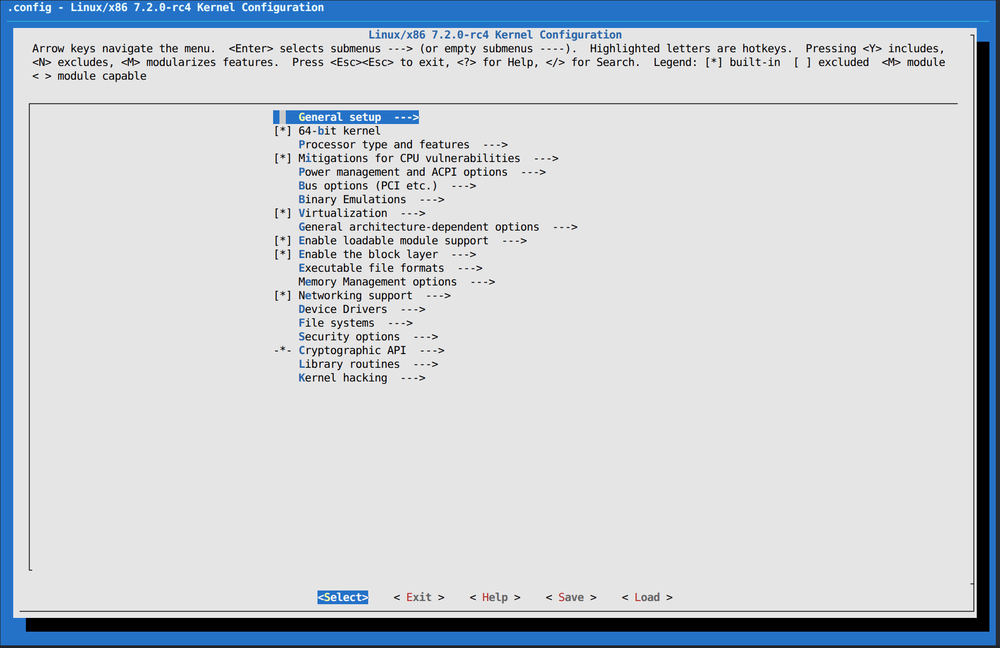

# Assignment 02

## Objective

Modify the Linux kernel **Git tree** from **Assignment 00** so that the running kernel version includes the suffix:

```text
-thor_kernel
```

The assignment specifically requires modifying the `EXTRAVERSION` field in the kernel `Makefile`.

---

# Turn In

You must submit:

- Kernel boot log
- A patch to the original `Makefile` following the Linux kernel submission standards (`Documentation/SubmittingPatches`)

---

# Option 1 — Modify `EXTRAVERSION` Using `menuconfig`

Although the assignment asks you to edit the `Makefile`, you can also set the local version through the kernel configuration.

## Step 1

Run:

```bash
make menuconfig
```

---

## Step 2

Navigate to:

```
General setup
```



---

## Step 3

Open:

```
General setup
    └── Local version - append to kernel release
```

Enter:

```text
-thor_kernel
```


---

## Step 4

Save the configuration.


---

## Build and Install the Kernel

After saving the configuration, rebuild and install the kernel:

```bash
make -j$(nproc)

sudo make modules_install
sudo make install
```

> **Note:** The original text contained `sudop make install`, which is a typo. The correct command is:
>
> ```bash
> sudo make install
> ```

---

## Update the Bootloader

After installing the kernel, regenerate your bootloader configuration.

If you are using **GRUB**, run:

```bash
sudo grub-mkconfig -o /boot/grub/grub.cfg
```

(or the equivalent command for your distribution).

If you do not use custom boot entries, GRUB should automatically select the newest kernel.

Finally, reboot:

```bash
sudo reboot
```

---

# Option 2 — Modify the `Makefile` (Recommended)

This is the method requested by the assignment.

Open the kernel `Makefile` and change:

```make
EXTRAVERSION = -rc4
```

to

```make
EXTRAVERSION = -rc4-thor_kernel
```

Save the file.

---

## Commit the Change

Stage the modified `Makefile`:

```bash
git add Makefile
```

Create a signed commit:

```bash
git commit -s -m "Makefile: Add -thor_kernel to EXTRAVERSION

Change the EXTRAVERSION field so the running kernel includes
-thor_kernel in its version string."
```

Example output:

```text
[master 215b783e9bac] Makefile: Add -thor_kernel to EXTRAVERSION
 Committer: root <root@lfs.localdomain>

Your name and email address were configured automatically based
on your username and hostname.

...

1 file changed, 1 insertion(+), 1 deletion(-)
```

---

## Generate the Patch

Create the patch file:

```bash
git format-patch -1
```

This generates a file similar to:

```text
0001-Makefile-Add-thor_kernel-to-EXTRAVERSION.patch
```

Example patch:

```patch
From 215b783e9bac86cf4b946f02f2ec55165b075ebe Mon Sep 17 00:00:00 2001
From: root <root@lfs.localdomain>
Date: Sun, 26 Jul 2026 15:09:15 +0200
Subject: [PATCH] Makefile: Add -thor_kernel to EXTRAVERSION

Change the EXTRAVERSION field so the running kernel includes
-thor_kernel in its version string.

Signed-off-by: root <root@lfs.localdomain>
---
 Makefile | 2 +-
 1 file changed, 1 insertion(+), 1 deletion(-)
 mode change 100644 => 100755 Makefile

diff --git a/Makefile b/Makefile
old mode 100644
new mode 100755
index 11539c3fd405..65786457710d
--- a/Makefile
+++ b/Makefile
@@ -2,7 +2,7 @@
 VERSION = 7
 PATCHLEVEL = 2
 SUBLEVEL = 0
-EXTRAVERSION = -rc4
+EXTRAVERSION = -rc4-thor_kernel
 NAME = Baby Opossum Posse

 # *DOCUMENTATION*
--
2.55.0
```

---

## Verify the Modification

You can verify the change before committing:

```bash
git diff Makefile
```

Example output:

```diff
diff --git a/Makefile b/Makefile
old mode 100644
new mode 100755
index 11539c3fd405..65786457710d
--- a/Makefile
+++ b/Makefile
@@ -2,7 +2,7 @@
 VERSION = 7
 PATCHLEVEL = 2
 SUBLEVEL = 0
-EXTRAVERSION = -rc4
+EXTRAVERSION = -rc4-thor_kernel
 NAME = Baby Opossum Posse

 # *DOCUMENTATION*
```

---

# Verification

After rebooting into the new kernel, verify that the new version is active.

## Bootloader Entry

Your new kernel should appear in the bootloader menu.


---

## Kernel Version

Verify the running kernel:

```bash
uname -r
```

Expected output:

```text
7.2.0-rc4-thor_kernel
```

---

## Kernel Log

You can also verify using:

```bash
dmesg | head
```

or

```bash
dmesg | grep Linux
```

Example:


---

# Summary

For this assignment you must:

- Modify the kernel version to include `-thor_kernel`
- Rebuild and install the kernel
- Boot into the new kernel
- Verify the new version
- Generate a Linux-standard patch using:

```bash
git format-patch -1
```

and submit both the patch and the kernel boot log.