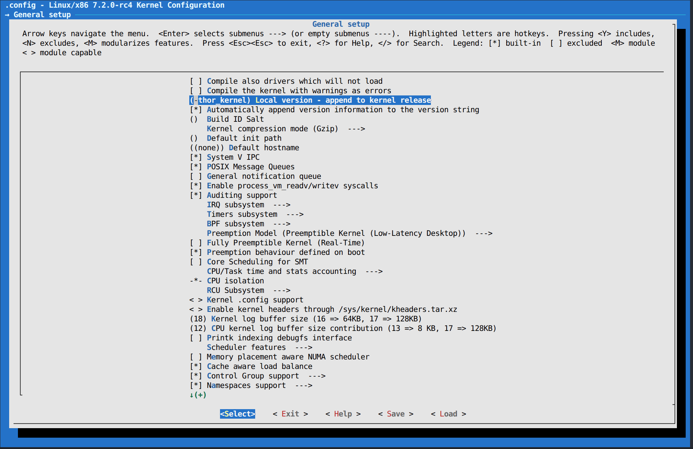
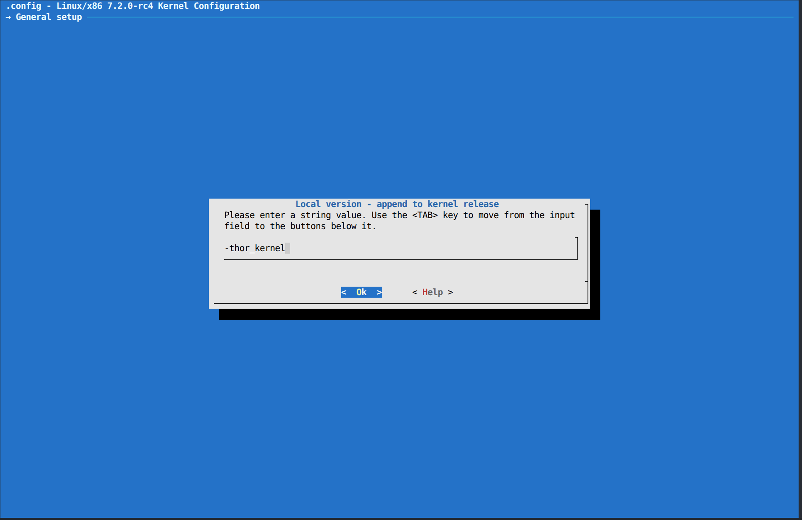
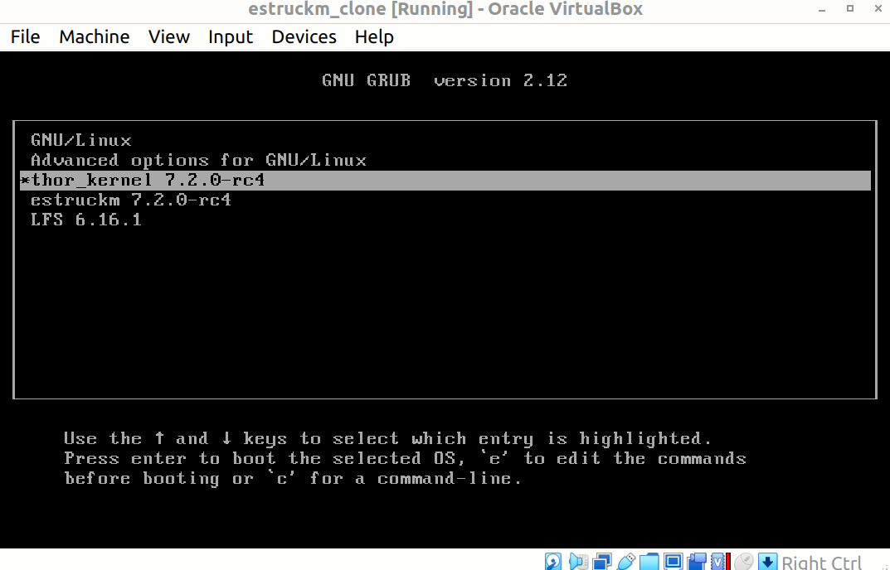
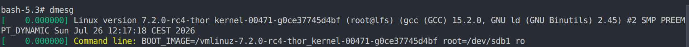

## Assignment 02

# To Do
• Take the kernel Git tree from Assignment 00 and modify the Makefile to change
the EXTRAVERSION field. Do it so the running kernel, after modifying, rebuilding,
and rebooting, includes "-thor_kernel" in its version string.
# Turn In
• Kernel boot log.
• A patch to the original Makefile, following Linux submission standards (Documentation/SubmittingPatches).

# change .config in your kernel source folder

# option_1
You can choose the graphical approach by calling 
```
make menuconfig
```
 Here you go to General setup select it and type your value for EXTRAVERSION naming

# step 1:


# step 2:



# step 3:



# install new kernel configuration

after saving the .config file we run:
```
make -j($nproc)
sudo make modules install
sudop make install
```

# update boot loader config

Now the kernel is installed with new extraversion tag. But we are not done yet. we also need to reconfigure our boot loader entries. In my case i use grub bootoader. Unless you have custom rules after doing
```
sudo grub-mkconfig
```
you should see the next entry in bootlaoder menu on start. Otherwise grub will choose the kernel with the hightest version automatically. After applying those changes we can reboot
```
reboot
```

# option_2 change it directly in the Makefile like asked in the subject

you need to change the EXTRAVERSION variable at the top to the required version_name:

EXTRAVERSION = -rc4-thor_kernel

then you save the file

after that:
```
git add /<your_linux_source_folder_path>/Makefile
git commit <your_linux_source_folder_path> -s -m "Makefile: Add -thor_kernel to EXTRAVERSION

Change the EXTRAVERSION field so the running kernel includes
-thor_kernel in its version string."
```
terminal output:
```
[master 215b783e9bac] Makefile: Add -thor_kernel to EXTRAVERSION
 Committer: root <root@lfs.localdomain>
Your name and email address were configured automatically based
on your username and hostname. Please check that they are accurate.
You can suppress this message by setting them explicitly. Run the
following command and follow the instructions in your editor to edit
your configuration file:

    git config --global --edit

After doing this, you may fix the identity used for this commit with:

    git commit --amend --reset-author

 1 file changed, 1 insertion(+), 1 deletion(-)
 mode change 100644 => 100755 Makefile
```

now we want to create the patch file using git:

```
git format-patch /<your_linux_source_folder_path> -1

```
the result will be saved in a patch file called: 0001-Makefile-Add-thor_kernel-to-EXTRAVERSION.patch
here the according output of the patch file:

```
From 215b783e9bac86cf4b946f02f2ec55165b075ebe Mon Sep 17 00:00:00 2001
From: root <root@lfs.localdomain>
Date: Sun, 26 Jul 2026 15:09:15 +0200
Subject: [PATCH] Makefile: Add -thor_kernel to EXTRAVERSION

Change the EXTRAVERSION field so the running kernel includes
-thor_kernel in its version string.

Signed-off-by: root <root@lfs.localdomain>
---
 Makefile | 2 +-
 1 file changed, 1 insertion(+), 1 deletion(-)
 mode change 100644 => 100755 Makefile

diff --git a/Makefile b/Makefile
old mode 100644
new mode 100755
index 11539c3fd405..65786457710d
--- a/Makefile
+++ b/Makefile
@@ -2,7 +2,7 @@
 VERSION = 7
 PATCHLEVEL = 2
 SUBLEVEL = 0
-EXTRAVERSION = -rc4
+EXTRAVERSION = -rc4-thor_kernel
 NAME = Baby Opossum Posse
 
 # *DOCUMENTATION*
-- 
2.55.0
```

```
git diff Makefile 
diff --git a/Makefile b/Makefile
old mode 100644
new mode 100755
index 11539c3fd405..65786457710d
--- a/Makefile
+++ b/Makefile
@@ -2,7 +2,7 @@
 VERSION = 7
 PATCHLEVEL = 2
 SUBLEVEL = 0
-EXTRAVERSION = -rc4
+EXTRAVERSION = -rc4-thor_kernel
 NAME = Baby Opossum Posse
 
 # *DOCUMENTATION*
 ```

if your kernel is a repositary



